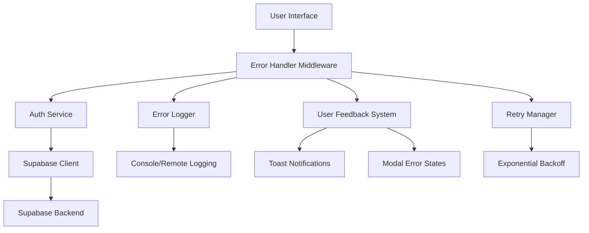

# Design Document - Authentication Error Handling

## Overview

Este documento define el diseño técnico para implementar un manejo robusto de errores en el sistema de autenticación de Anclora Kairon. El diseño se basa en la arquitectura actual que utiliza Supabase como backend de autenticación, con componentes modulares en JavaScript vanilla y servicios centralizados.

## Architecture

### Current System Analysis

Basado en la investigación del código existente, el sistema actual incluye:

- **AuthService** (`src/shared/services/authService.js`): Servicio centralizado para operaciones de autenticación
- **Supabase Client** (`src/shared/config/supabase.js`): Cliente configurado para comunicación con Supabase
- **Auth Modal** (`src/shared/components/AuthModalVanilla.js`): Modal de autenticación con soporte i18n
- **Onboarding Wizard** (`src/shared/components/OnboardingWizard.js`): Flujo de onboarding para nuevos usuarios
- **Test Pages**: Múltiples páginas de prueba para validar funcionalidad

### Enhanced Architecture



## Components and Interfaces

### 1. Error Handler Middleware

**Purpose**: Interceptar y procesar todos los errores de autenticación antes de mostrarlos al usuario.

**Interface**:
```javascript
class AuthErrorHandler {
    // Procesar errores y determinar la respuesta apropiada
    handleError(error, context)
    
    // Clasificar tipos de error
    classifyError(error)
    
    // Generar mensajes amigables al usuario
    generateUserMessage(errorType, language)
    
    // Determinar si se debe permitir retry
    shouldAllowRetry(errorType, attemptCount)
}
```

**Error Categories**:
- `NETWORK_ERROR`: Problemas de conectividad
- `AUTH_INVALID_CREDENTIALS`: Credenciales incorrectas
- `AUTH_USER_NOT_FOUND`: Usuario no existe
- `AUTH_USER_EXISTS`: Usuario ya registrado
- `AUTH_WEAK_PASSWORD`: Contraseña no cumple requisitos
- `AUTH_RATE_LIMITED`: Demasiados intentos
- `SERVER_ERROR`: Error interno del servidor
- `UNKNOWN_ERROR`: Error no clasificado

### 2. Enhanced Auth Service

**Purpose**: Extender el AuthService existente con capacidades de manejo de errores.

**New Methods**:
```javascript
class EnhancedAuthService extends AuthService {
    // Registro con manejo de errores mejorado
    async registerWithErrorHandling(name, email, password)
    
    // Login con reintentos automáticos
    async loginWithRetry(email, password, maxRetries = 3)
    
    // Verificar conectividad con Supabase
    async checkConnectivity()
    
    // Obtener estado detallado del sistema
    getSystemStatus()
}
```

### 3. Connection Monitor

**Purpose**: Monitorear la conectividad con Supabase y detectar problemas de red.

**Interface**:
```javascript
class ConnectionMonitor {
    // Iniciar monitoreo de conectividad
    startMonitoring()
    
    // Verificar si Supabase está disponible
    async isSupabaseAvailable()
    
    // Obtener latencia de conexión
    async getConnectionLatency()
    
    // Eventos de cambio de conectividad
    onConnectionChange(callback)
}
```

### 4. User Feedback System

**Purpose**: Proporcionar feedback visual consistente al usuario durante operaciones de autenticación.

**Components**:
- **Loading States**: Indicadores de progreso durante operaciones
- **Error Messages**: Mensajes de error contextuales y traducidos
- **Success Confirmations**: Confirmaciones de operaciones exitosas
- **Retry Options**: Botones y opciones para reintentar operaciones

**Interface**:
```javascript
class UserFeedbackSystem {
    // Mostrar estado de carga
    showLoading(operation, message)
    
    // Ocultar estado de carga
    hideLoading()
    
    // Mostrar mensaje de error con opciones
    showError(error, options = {})
    
    // Mostrar mensaje de éxito
    showSuccess(message)
    
    // Mostrar opciones de retry
    showRetryOptions(error, retryCallback)
}
```

### 5. Error Logger

**Purpose**: Registrar errores para diagnóstico y monitoreo.

**Interface**:
```javascript
class ErrorLogger {
    // Registrar error con contexto
    logError(error, context, severity)
    
    // Registrar métricas de rendimiento
    logPerformanceMetric(operation, duration, success)
    
    // Obtener estadísticas de errores
    getErrorStats()
    
    // Configurar logging remoto (opcional)
    configureRemoteLogging(endpoint)
}
```

## Data Models

### Error Context Model
```javascript
{
    operation: string,        // 'login', 'register', 'logout', etc.
    timestamp: Date,
    userAgent: string,
    url: string,
    userId: string | null,
    attemptCount: number,
    previousErrors: Array<Error>
}
```

### System Status Model
```javascript
{
    supabaseConnected: boolean,
    supabaseLatency: number | null,
    authServiceReady: boolean,
    lastError: Error | null,
    errorCount: number,
    uptime: number
}
```

### User Feedback State Model
```javascript
{
    isLoading: boolean,
    loadingMessage: string | null,
    error: {
        type: string,
        message: string,
        canRetry: boolean,
        retryCount: number
    } | null,
    success: string | null
}
```

## Error Handling

### Error Classification Strategy

1. **Network Errors**:
   - Timeout errors
   - Connection refused
   - DNS resolution failures
   - CORS errors

2. **Authentication Errors**:
   - Invalid credentials
   - User not found
   - User already exists
   - Weak password
   - Email not confirmed

3. **Server Errors**:
   - 5xx HTTP status codes
   - Supabase service unavailable
   - Database connection errors

4. **Client Errors**:
   - Invalid input format
   - Missing required fields
   - Rate limiting

### Error Recovery Strategies

1. **Automatic Retry**:
   - Network errors: Exponential backoff (1s, 2s, 4s)
   - Server errors: Limited retries (max 3)
   - Rate limiting: Respect retry-after headers

2. **User-Initiated Retry**:
   - Clear retry button for failed operations
   - Reset error state before retry
   - Track retry attempts

3. **Graceful Degradation**:
   - Offline mode indicators
   - Cached data when possible
   - Alternative authentication methods

### Error Message Localization

**Spanish Messages**:
```javascript
const errorMessages = {
    NETWORK_ERROR: "No se pudo conectar al servidor. Verifica tu conexión a internet.",
    AUTH_INVALID_CREDENTIALS: "Email o contraseña incorrectos. Inténtalo de nuevo.",
    AUTH_USER_NOT_FOUND: "No encontramos una cuenta con este email.",
    AUTH_USER_EXISTS: "Ya existe una cuenta con este email. ¿Quieres iniciar sesión?",
    AUTH_WEAK_PASSWORD: "La contraseña debe tener al menos 6 caracteres.",
    SERVER_ERROR: "Error del servidor. Inténtalo de nuevo en unos momentos.",
    UNKNOWN_ERROR: "Ocurrió un error inesperado. Contacta al soporte si persiste."
};
```

**English Messages**:
```javascript
const errorMessages = {
    NETWORK_ERROR: "Could not connect to server. Check your internet connection.",
    AUTH_INVALID_CREDENTIALS: "Invalid email or password. Please try again.",
    AUTH_USER_NOT_FOUND: "No account found with this email address.",
    AUTH_USER_EXISTS: "An account with this email already exists. Want to sign in?",
    AUTH_WEAK_PASSWORD: "Password must be at least 6 characters long.",
    SERVER_ERROR: "Server error. Please try again in a few moments.",
    UNKNOWN_ERROR: "An unexpected error occurred. Contact support if it persists."
};
```

## Testing Strategy

### Unit Tests

1. **Error Handler Tests**:
   - Error classification accuracy
   - Message generation for different locales
   - Retry logic validation

2. **Auth Service Tests**:
   - Mock Supabase responses for different error scenarios
   - Retry mechanism testing
   - State management during errors

3. **Connection Monitor Tests**:
   - Network connectivity simulation
   - Latency measurement accuracy
   - Event emission testing

### Integration Tests

1. **End-to-End Error Flows**:
   - Complete registration with network errors
   - Login with invalid credentials
   - OAuth failures and recovery

2. **User Experience Tests**:
   - Error message display timing
   - Loading state transitions
   - Retry button functionality

### Error Simulation Tests

1. **Network Conditions**:
   - Offline mode simulation
   - Slow network conditions
   - Intermittent connectivity

2. **Server Responses**:
   - Mock various HTTP error codes
   - Simulate Supabase service outages
   - Test rate limiting scenarios

### Performance Tests

1. **Error Handling Overhead**:
   - Measure impact on normal operations
   - Memory usage during error states
   - Recovery time measurements

2. **Logging Performance**:
   - Log writing performance
   - Storage usage monitoring
   - Remote logging latency

## Implementation Phases

### Phase 1: Core Error Handling (Week 1)
- Implement AuthErrorHandler class
- Enhance existing AuthService with error handling
- Basic error classification and messaging

### Phase 2: User Feedback System (Week 2)
- Implement loading states in auth modal
- Add error message display components
- Integrate retry functionality

### Phase 3: Connection Monitoring (Week 3)
- Implement ConnectionMonitor
- Add connectivity status indicators
- Implement automatic retry logic

### Phase 4: Logging and Analytics (Week 4)
- Implement ErrorLogger
- Add performance monitoring
- Optional remote logging setup

### Phase 5: Testing and Refinement (Week 5)
- Comprehensive testing suite
- User experience testing
- Performance optimization

## Security Considerations

1. **Error Information Disclosure**:
   - Avoid exposing sensitive system information in error messages
   - Log detailed errors server-side, show generic messages to users
   - Sanitize error messages before display

2. **Rate Limiting**:
   - Implement client-side rate limiting for retry attempts
   - Respect server-side rate limiting headers
   - Prevent brute force attacks through error handling

3. **Logging Security**:
   - Never log passwords or sensitive user data
   - Sanitize user input before logging
   - Secure remote logging endpoints if implemented

## Monitoring and Metrics

### Key Metrics to Track

1. **Error Rates**:
   - Authentication failure rate by error type
   - Network error frequency
   - Recovery success rate

2. **Performance Metrics**:
   - Average authentication time
   - Error handling overhead
   - User retry behavior

3. **User Experience Metrics**:
   - Time to error resolution
   - User abandonment after errors
   - Success rate after retry attempts

### Alerting Thresholds

- Network error rate > 10% in 5 minutes
- Authentication failure rate > 25% in 10 minutes
- Server error rate > 5% in 5 minutes
- Average response time > 5 seconds

This design provides a comprehensive approach to handling authentication errors while maintaining the existing architecture and improving user experience significantly.