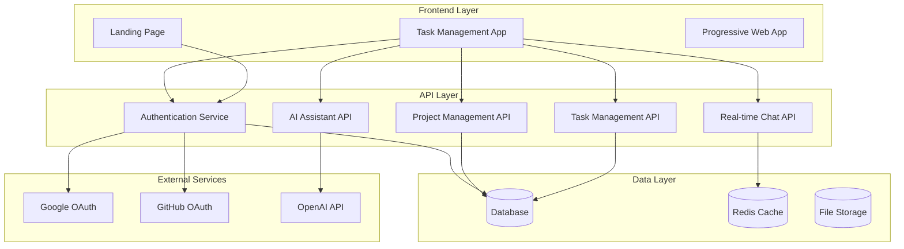

# Design Document

## Overview

Este documento define el diseño técnico para expandir la aplicación Anclora Kairon existente con una landing page profesional y un MVP mejorado de gestión de tareas. La solución seguirá principios API-First y Mobile-First, implementando la guía visual del ecosistema Anclora con funcionalidades avanzadas de colaboración, proyectos y asistente IA.

## Architecture

### High-Level Architecture



### Technology Stack

**Frontend:**
- **Framework:** Vanilla JavaScript con React CDN (mantener compatibilidad con código existente)
- **Styling:** TailwindCSS + CSS personalizado para sistema Anclora
- **Build:** Vite para desarrollo, build estático para producción
- **PWA:** Service Workers para funcionalidad offline

**Backend API:**
- **Runtime:** Node.js con Express.js
- **Database:** PostgreSQL para datos principales
- **Cache:** Redis para sesiones y chat en tiempo real
- **Authentication:** JWT + OAuth 2.0 (Google, GitHub)
- **Real-time:** Socket.io para chat y actualizaciones

**Infrastructure:**
- **Hosting:** Vercel/Netlify (frontend), Railway/Render (backend)
- **Database:** Supabase/PlanetScale (PostgreSQL managed)
- **Storage:** Cloudinary para archivos
- **Monitoring:** Sentry para errores## Co
mponents and Interfaces

### Landing Page Components

#### 1. Hero Section
```javascript
// HeroSection.js
const HeroSection = () => {
  return {
    background: 'linear-gradient(120deg, #23436B 0%, #2EAFC4 100%)',
    typography: 'Libre Baskerville',
    cta: 'Comenzar Gratis',
    features: ['Gestión de proyectos', 'Colaboración en tiempo real', 'IA integrada']
  }
}
```

#### 2. Features Section
- **Gestión de Proyectos:** Dashboard con métricas y diagrama Gantt-Kanban híbrido
- **Colaboración:** Chat en tiempo real y asignación de tareas
- **IA Assistant:** Chatbot integrado con sugerencias inteligentes
- **Analytics:** Métricas de productividad y eficiencia del equipo

#### 3. CTA Components
```javascript
const CTAButton = {
  primary: {
    background: 'linear-gradient(90deg, #2EAFC4 0%, #FFC979 100%)',
    color: '#162032',
    borderRadius: '12px',
    padding: '12px 28px',
    fontWeight: '700'
  },
  secondary: {
    background: 'transparent',
    color: '#2EAFC4',
    border: '2px solid #2EAFC4'
  }
}
```

### Application Components

#### 1. Enhanced Kanban Board
```javascript
const EnhancedKanbanBoard = {
  columns: ['Por Hacer', 'En Progreso', 'En Revisión', 'Hecho'],
  features: {
    dragAndDrop: true,
    realTimeUpdates: true,
    taskFiltering: true,
    bulkActions: true
  },
  styling: {
    background: 'var(--card-bg)',
    borderRadius: '20px',
    glassMorphism: true
  }
}
```

#### 2. Project Dashboard
```javascript
const ProjectDashboard = {
  components: {
    metricsCards: ['Tareas completadas', 'Tiempo promedio', 'Eficiencia del equipo'],
    hybridChart: 'GanttKanbanChart',
    teamMembers: 'TeamMembersList',
    recentActivity: 'ActivityFeed'
  },
  layout: 'CSS Grid responsive'
}
```

#### 3. Hybrid Gantt-Kanban Chart
```javascript
const HybridChart = {
  timelineView: {
    library: 'D3.js o Chart.js',
    features: ['Dependencias', 'Hitos', 'Progreso visual']
  },
  kanbanView: {
    integration: 'Mismo dataset',
    switchMode: 'Toggle button'
  }
}
```

#### 4. Real-time Chat
```javascript
const ChatComponent = {
  backend: 'Socket.io',
  features: {
    mentions: '@username',
    fileSharing: true,
    messageHistory: true,
    onlineStatus: true
  },
  ui: {
    position: 'Sidebar colapsible',
    styling: 'Anclora glass effect'
  }
}
```

#### 5. AI Assistant
```javascript
const AIAssistant = {
  integration: 'OpenAI API',
  features: {
    taskSuggestions: true,
    projectInsights: true,
    productivityTips: true,
    naturalLanguage: true
  },
  ui: {
    chatInterface: true,
    floatingButton: true,
    contextAware: true
  }
}
```## Da
ta Models

### User Model
```sql
CREATE TABLE users (
  id UUID PRIMARY KEY DEFAULT gen_random_uuid(),
  email VARCHAR(255) UNIQUE NOT NULL,
  name VARCHAR(255) NOT NULL,
  avatar_url TEXT,
  provider VARCHAR(50), -- 'email', 'google', 'github'
  provider_id VARCHAR(255),
  preferences JSONB DEFAULT '{}',
  created_at TIMESTAMP DEFAULT NOW(),
  updated_at TIMESTAMP DEFAULT NOW()
);
```

### Project Model
```sql
CREATE TABLE projects (
  id UUID PRIMARY KEY DEFAULT gen_random_uuid(),
  name VARCHAR(255) NOT NULL,
  description TEXT,
  owner_id UUID REFERENCES users(id),
  status VARCHAR(50) DEFAULT 'active',
  start_date DATE,
  end_date DATE,
  color VARCHAR(7) DEFAULT '#2EAFC4',
  settings JSONB DEFAULT '{}',
  created_at TIMESTAMP DEFAULT NOW(),
  updated_at TIMESTAMP DEFAULT NOW()
);
```

### Task Model
```sql
CREATE TABLE tasks (
  id UUID PRIMARY KEY DEFAULT gen_random_uuid(),
  title VARCHAR(255) NOT NULL,
  description TEXT,
  project_id UUID REFERENCES projects(id),
  assigned_to UUID REFERENCES users(id),
  created_by UUID REFERENCES users(id),
  status VARCHAR(50) DEFAULT 'todo',
  priority VARCHAR(20) DEFAULT 'medium',
  due_date TIMESTAMP,
  estimated_hours DECIMAL(5,2),
  actual_hours DECIMAL(5,2),
  tags TEXT[],
  position INTEGER,
  dependencies UUID[],
  created_at TIMESTAMP DEFAULT NOW(),
  updated_at TIMESTAMP DEFAULT NOW()
);
```

### Project Members Model
```sql
CREATE TABLE project_members (
  id UUID PRIMARY KEY DEFAULT gen_random_uuid(),
  project_id UUID REFERENCES projects(id),
  user_id UUID REFERENCES users(id),
  role VARCHAR(50) DEFAULT 'member', -- 'owner', 'admin', 'member', 'viewer'
  permissions JSONB DEFAULT '{}',
  joined_at TIMESTAMP DEFAULT NOW(),
  UNIQUE(project_id, user_id)
);
```

### Chat Messages Model
```sql
CREATE TABLE chat_messages (
  id UUID PRIMARY KEY DEFAULT gen_random_uuid(),
  project_id UUID REFERENCES projects(id),
  user_id UUID REFERENCES users(id),
  message TEXT NOT NULL,
  message_type VARCHAR(20) DEFAULT 'text', -- 'text', 'file', 'system'
  mentions UUID[],
  reply_to UUID REFERENCES chat_messages(id),
  created_at TIMESTAMP DEFAULT NOW()
);
```

### Analytics Model
```sql
CREATE TABLE user_analytics (
  id UUID PRIMARY KEY DEFAULT gen_random_uuid(),
  user_id UUID REFERENCES users(id),
  project_id UUID REFERENCES projects(id),
  date DATE NOT NULL,
  tasks_completed INTEGER DEFAULT 0,
  hours_worked DECIMAL(5,2) DEFAULT 0,
  efficiency_score DECIMAL(3,2), -- 0.00 to 1.00
  created_at TIMESTAMP DEFAULT NOW(),
  UNIQUE(user_id, project_id, date)
);
```## V
isual Design System

### Color Palette (Anclora Kairon)
```css
:root {
  /* Base Colors */
  --azul-profundo: #23436B;
  --azul-claro: #2EAFC4;
  --teal-secundario: #37B5A4;
  --ambar-suave: #FFC979;
  --gris-claro: #F6F7F9;
  --negro-azulado: #162032;
  --blanco: #FFFFFF;
  
  /* Gradients */
  --gradient-hero: linear-gradient(120deg, #23436B 0%, #2EAFC4 100%);
  --gradient-action: linear-gradient(90deg, #2EAFC4 0%, #FFC979 100%);
  --gradient-subtle: linear-gradient(180deg, #F6F7F9 0%, #FFFFFF 100%);
  
  /* Dark Mode */
  --dark-bg-primary: #162032;
  --dark-bg-secondary: #202837;
  --dark-text-primary: #F6F7F9;
  --dark-border: #313848;
}
```

### Typography System
```css
/* Libre Baskerville - Títulos */
.heading-display {
  font-family: 'Libre Baskerville', serif;
  font-weight: 700;
  font-size: 3.75rem;
  line-height: 1;
  letter-spacing: -0.05em;
}

.heading-h1 {
  font-family: 'Libre Baskerville', serif;
  font-weight: 700;
  font-size: 3rem;
  line-height: 1.25;
  letter-spacing: -0.025em;
}

/* Inter - Interfaz */
.body-text {
  font-family: 'Inter', sans-serif;
  font-size: 1rem;
  line-height: 1.625;
  font-weight: 400;
}

.button-text {
  font-family: 'Inter', sans-serif;
  font-weight: 700;
  font-size: 1rem;
}

/* JetBrains Mono - Código */
.code-text {
  font-family: 'JetBrains Mono', monospace;
  font-size: 0.9rem;
  line-height: 1.4;
}
```

### Component Styles
```css
/* Glass Morphism Cards */
.glass-card {
  background: rgba(46, 175, 196, 0.15);
  border: 1px solid rgba(46, 175, 196, 0.2);
  border-radius: 20px;
  backdrop-filter: blur(10px);
  box-shadow: 0 8px 32px rgba(0, 0, 0, 0.1);
}

/* Buttons */
.btn-primary {
  background: var(--gradient-action);
  color: var(--negro-azulado);
  border: none;
  border-radius: 12px;
  padding: 12px 28px;
  font-weight: 700;
  transition: all 0.3s ease;
  box-shadow: 0 4px 15px rgba(46, 175, 196, 0.3);
}

.btn-primary:hover {
  transform: translateY(-2px);
  box-shadow: 0 6px 20px rgba(46, 175, 196, 0.4);
}

/* Task Cards */
.task-card {
  background: var(--card-bg);
  border: 1px solid var(--card-border);
  border-radius: 16px;
  padding: 20px;
  margin-bottom: 16px;
  box-shadow: 0 4px 20px rgba(0, 0, 0, 0.08);
  transition: all 0.3s ease;
}

.task-card:hover {
  transform: translateY(-2px);
  box-shadow: 0 8px 30px rgba(0, 0, 0, 0.12);
}
```

## Error Handling

### Frontend Error Boundaries
```javascript
class ErrorBoundary extends React.Component {
  constructor(props) {
    super(props);
    this.state = { hasError: false, error: null };
  }

  static getDerivedStateFromError(error) {
    return { hasError: true, error };
  }

  componentDidCatch(error, errorInfo) {
    console.error('Error caught by boundary:', error, errorInfo);
  }

  render() {
    if (this.state.hasError) {
      return (
        <div className="error-fallback">
          <h2>Algo salió mal</h2>
          <p>Por favor, recarga la página o contacta soporte.</p>
          <button onClick={() => window.location.reload()}>
            Recargar página
          </button>
        </div>
      );
    }

    return this.props.children;
  }
}
```

## Testing Strategy

### Unit Testing
```javascript
// Jest + Testing Library
describe('TaskCard Component', () => {
  test('renders task information correctly', () => {
    const task = {
      id: '1',
      title: 'Test Task',
      description: 'Test Description',
      status: 'todo',
      priority: 'high'
    };

    render(<TaskCard task={task} />);
    
    expect(screen.getByText('Test Task')).toBeInTheDocument();
    expect(screen.getByText('Test Description')).toBeInTheDocument();
  });
});
```

Este diseño técnico proporciona una base sólida para implementar todas las funcionalidades requeridas mientras mantiene la escalabilidad, seguridad y la identidad visual del ecosistema Anclora.