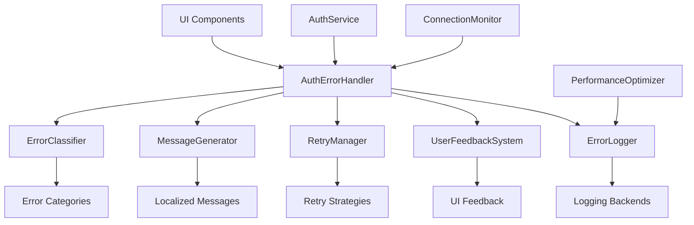

# 🛠️ Guía para Desarrolladores - Sistema de Manejo de Errores

## 📋 Índice

1. [Arquitectura del Sistema](#arquitectura-del-sistema)
2. [Componentes Principales](#componentes-principales)
3. [Extender el Sistema](#extender-el-sistema)
4. [Mejores Prácticas](#mejores-prácticas)
5. [Testing](#testing)
6. [Debugging](#debugging)
7. [Contribuir](#contribuir)

## 🏗️ Arquitectura del Sistema

### Visión General

El sistema de manejo de errores está diseñado con una arquitectura modular que permite:

- **Separación de responsabilidades**: Cada componente tiene una función específica
- **Extensibilidad**: Fácil agregar nuevos tipos de error y estrategias de recuperación
- **Testabilidad**: Componentes aislados que pueden ser probados independientemente
- **Mantenibilidad**: Código organizado y bien documentado

### Diagrama de Arquitectura



### Flujo de Manejo de Errores

1. **Captura**: Error ocurre en AuthService o componente UI
2. **Clasificación**: ErrorClassifier determina el tipo de error
3. **Procesamiento**: AuthErrorHandler procesa el error
4. **Mensaje**: MessageGenerator crea mensaje localizado
5. **Recuperación**: RetryManager determina estrategia de reintento
6. **Feedback**: UserFeedbackSystem muestra información al usuario
7. **Logging**: ErrorLogger registra el error para análisis

## 🧩 Componentes Principales

### AuthErrorHandler

**Ubicación**: `src/shared/services/authErrorHandler.js`

**Responsabilidades**:
- Punto central de procesamiento de errores
- Coordinación entre otros componentes
- Determinación de estrategias de recuperación

```javascript
class AuthErrorHandler {
  constructor(options = {}) {
    this.classifier = new ErrorClassifier();
    this.messageGenerator = new MessageGenerator(options.language || 'es');
    this.retryManager = new RetryManager();
    this.feedbackSystem = new UserFeedbackSystem();
    this.logger = new ErrorLogger();
  }

  async handleError(error, context = {}) {
    // 1. Clasificar error
    const errorType = this.classifier.classify(error);
    
    // 2. Generar mensaje
    const message = this.messageGenerator.generate(errorType, context);
    
    // 3. Determinar estrategia de reintento
    const retryStrategy = this.retryManager.getStrategy(errorType);
    
    // 4. Mostrar feedback al usuario
    await this.feedbackSystem.showError(message, {
      canRetry: retryStrategy.canRetry,
      onRetry: retryStrategy.retryCallback
    });
    
    // 5. Registrar error
    this.logger.logError(error, {
      ...context,
      errorType,
      timestamp: new Date().toISOString()
    });
    
    return {
      errorType,
      message,
      canRetry: retryStrategy.canRetry
    };
  }
}
```

### ErrorClassifier

**Ubicación**: `src/shared/services/errorClassifier.js`

**Responsabilidades**:
- Analizar errores y determinar su tipo
- Mapear códigos HTTP a tipos de error
- Detectar patrones específicos de error

```javascript
class ErrorClassifier {
  classify(error) {
    // Clasificación por código HTTP
    if (error.status) {
      return this.classifyByHttpStatus(error.status, error);
    }
    
    // Clasificación por mensaje de Supabase
    if (error.message) {
      return this.classifyByMessage(error.message);
    }
    
    // Clasificación por tipo de error JavaScript
    if (error instanceof TypeError) {
      return 'VALIDATION_ERROR';
    }
    
    if (error.name === 'NetworkError') {
      return 'NETWORK_ERROR';
    }
    
    return 'UNKNOWN_ERROR';
  }

  classifyByHttpStatus(status, error) {
    const statusMap = {
      400: () => this.classifyBadRequest(error),
      401: 'AUTH_INVALID_CREDENTIALS',
      403: 'AUTH_FORBIDDEN',
      404: 'AUTH_USER_NOT_FOUND',
      409: 'AUTH_USER_EXISTS',
      422: 'AUTH_WEAK_PASSWORD',
      429: 'AUTH_RATE_LIMITED',
      500: 'SERVER_ERROR',
      502: 'SUPABASE_UNAVAILABLE',
      503: 'SERVICE_UNAVAILABLE',
      504: 'TIMEOUT_ERROR'
    };

    const classifier = statusMap[status];
    return typeof classifier === 'function' ? classifier() : classifier || 'UNKNOWN_ERROR';
  }

  classifyBadRequest(error) {
    const message = error.message?.toLowerCase() || '';
    
    if (message.includes('password')) {
      return 'AUTH_WEAK_PASSWORD';
    }
    
    if (message.includes('email')) {
      return 'VALIDATION_ERROR';
    }
    
    return 'VALIDATION_ERROR';
  }

  classifyByMessage(message) {
    const lowerMessage = message.toLowerCase();
    
    const patterns = {
      'invalid login credentials': 'AUTH_INVALID_CREDENTIALS',
      'user not found': 'AUTH_USER_NOT_FOUND',
      'user already registered': 'AUTH_USER_EXISTS',
      'password should be at least': 'AUTH_WEAK_PASSWORD',
      'email not confirmed': 'AUTH_EMAIL_NOT_CONFIRMED',
      'too many requests': 'AUTH_RATE_LIMITED',
      'network error': 'NETWORK_ERROR',
      'fetch failed': 'NETWORK_ERROR'
    };

    for (const [pattern, errorType] of Object.entries(patterns)) {
      if (lowerMessage.includes(pattern)) {
        return errorType;
      }
    }

    return 'UNKNOWN_ERROR';
  }
}
```

### MessageGenerator

**Ubicación**: `src/shared/services/messageGenerator.js`

**Responsabilidades**:
- Generar mensajes localizados para usuarios
- Interpolar parámetros en mensajes
- Manejar pluralización y contexto

```javascript
class MessageGenerator {
  constructor(language = 'es') {
    this.language = language;
    this.messages = this.loadMessages();
  }

  generate(errorType, context = {}) {
    const template = this.messages[this.language][errorType] || 
                    this.messages[this.language]['UNKNOWN_ERROR'];
    
    return this.interpolate(template, context);
  }

  interpolate(template, context) {
    return template.replace(/\{(\w+)\}/g, (match, key) => {
      return context[key] || match;
    });
  }

  loadMessages() {
    return {
      es: {
        NETWORK_ERROR: "No se pudo conectar al servidor. Verifica tu conexión a internet.",
        AUTH_INVALID_CREDENTIALS: "Email o contraseña incorrectos. Inténtalo de nuevo.",
        AUTH_USER_NOT_FOUND: "No encontramos una cuenta con este email. ¿Quieres registrarte?",
        AUTH_USER_EXISTS: "Ya existe una cuenta con este email. ¿Quieres iniciar sesión?",
        AUTH_WEAK_PASSWORD: "La contraseña debe tener al menos {minLength} caracteres.",
        AUTH_RATE_LIMITED: "Demasiados intentos. Espera {waitTime} antes de intentar nuevamente.",
        UNKNOWN_ERROR: "Ocurrió un error inesperado. Contacta al soporte si persiste."
      },
      en: {
        NETWORK_ERROR: "Could not connect to server. Check your internet connection.",
        AUTH_INVALID_CREDENTIALS: "Invalid email or password. Please try again.",
        AUTH_USER_NOT_FOUND: "No account found with this email. Would you like to sign up?",
        AUTH_USER_EXISTS: "An account with this email already exists. Would you like to sign in?",
        AUTH_WEAK_PASSWORD: "Password must be at least {minLength} characters long.",
        AUTH_RATE_LIMITED: "Too many attempts. Please wait {waitTime} before trying again.",
        UNKNOWN_ERROR: "An unexpected error occurred. Contact support if it persists."
      }
    };
  }
}
```

### RetryManager

**Ubicación**: `src/shared/services/retryManager.js`

**Responsabilidades**:
- Determinar si un error puede ser reintentado
- Implementar estrategias de backoff
- Gestionar límites de reintentos

```javascript
class RetryManager {
  constructor() {
    this.retryStrategies = this.initializeStrategies();
    this.attemptCounts = new Map();
  }

  getStrategy(errorType) {
    const strategy = this.retryStrategies[errorType] || this.retryStrategies.default;
    
    return {
      canRetry: this.canRetry(errorType),
      maxAttempts: strategy.maxAttempts,
      delay: this.calculateDelay(errorType),
      retryCallback: () => this.handleRetry(errorType)
    };
  }

  canRetry(errorType) {
    const strategy = this.retryStrategies[errorType];
    if (!strategy || !strategy.canRetry) return false;
    
    const attempts = this.attemptCounts.get(errorType) || 0;
    return attempts < strategy.maxAttempts;
  }

  calculateDelay(errorType) {
    const strategy = this.retryStrategies[errorType] || this.retryStrategies.default;
    const attempts = this.attemptCounts.get(errorType) || 0;
    
    // Exponential backoff: 1s, 2s, 4s, 8s...
    return strategy.baseDelay * Math.pow(2, attempts);
  }

  handleRetry(errorType) {
    const currentAttempts = this.attemptCounts.get(errorType) || 0;
    this.attemptCounts.set(errorType, currentAttempts + 1);
  }

  resetAttempts(errorType) {
    this.attemptCounts.delete(errorType);
  }

  initializeStrategies() {
    return {
      NETWORK_ERROR: {
        canRetry: true,
        maxAttempts: 3,
        baseDelay: 1000
      },
      SUPABASE_UNAVAILABLE: {
        canRetry: true,
        maxAttempts: 3,
        baseDelay: 2000
      },
      TIMEOUT_ERROR: {
        canRetry: true,
        maxAttempts: 2,
        baseDelay: 1000
      },
      AUTH_INVALID_CREDENTIALS: {
        canRetry: true,
        maxAttempts: 5,
        baseDelay: 0
      },
      AUTH_RATE_LIMITED: {
        canRetry: true,
        maxAttempts: 1,
        baseDelay: 60000 // 1 minuto
      },
      SERVER_ERROR: {
        canRetry: true,
        maxAttempts: 3,
        baseDelay: 5000
      },
      default: {
        canRetry: false,
        maxAttempts: 0,
        baseDelay: 0
      }
    };
  }
}
```

## 🔧 Extender el Sistema

### Agregar Nuevos Tipos de Error

1. **Definir el código de error** en `ERROR_CODES_REFERENCE.md`
2. **Agregar clasificación** en `ErrorClassifier`
3. **Agregar mensajes** en `MessageGenerator`
4. **Definir estrategia de reintento** en `RetryManager`
5. **Escribir tests** para el nuevo tipo de error

**Ejemplo: Agregar error de cuota excedida**

```javascript
// 1. En ErrorClassifier
classifyByMessage(message) {
  const patterns = {
    // ... patrones existentes
    'quota exceeded': 'AUTH_QUOTA_EXCEEDED'
  };
  // ... resto del método
}

// 2. En MessageGenerator
loadMessages() {
  return {
    es: {
      // ... mensajes existentes
      AUTH_QUOTA_EXCEEDED: "Has excedido tu cuota de uso. Inténtalo mañana."
    },
    en: {
      // ... mensajes existentes
      AUTH_QUOTA_EXCEEDED: "You have exceeded your usage quota. Try again tomorrow."
    }
  };
}

// 3. En RetryManager
initializeStrategies() {
  return {
    // ... estrategias existentes
    AUTH_QUOTA_EXCEEDED: {
      canRetry: true,
      maxAttempts: 1,
      baseDelay: 86400000 // 24 horas
    }
  };
}
```

### Agregar Nuevos Backends de Logging

```javascript
// Ejemplo: Agregar logging remoto
class RemoteLogger {
  constructor(endpoint, apiKey) {
    this.endpoint = endpoint;
    this.apiKey = apiKey;
  }

  async log(errorData) {
    try {
      await fetch(this.endpoint, {
        method: 'POST',
        headers: {
          'Content-Type': 'application/json',
          'Authorization': `Bearer ${this.apiKey}`
        },
        body: JSON.stringify(errorData)
      });
    } catch (error) {
      console.warn('Failed to send error to remote logger:', error);
    }
  }
}

// Integrar en ErrorLogger
class ErrorLogger {
  constructor() {
    this.backends = [
      new ConsoleLogger(),
      new LocalStorageLogger(),
      new RemoteLogger(process.env.LOGGING_ENDPOINT, process.env.LOGGING_API_KEY)
    ];
  }

  async logError(error, context) {
    const errorData = this.formatError(error, context);
    
    // Enviar a todos los backends
    await Promise.allSettled(
      this.backends.map(backend => backend.log(errorData))
    );
  }
}
```

### Personalizar Feedback de Usuario

```javascript
// Ejemplo: Agregar notificaciones toast
class ToastFeedbackSystem extends UserFeedbackSystem {
  showError(message, options = {}) {
    // Llamar implementación base
    super.showError(message, options);
    
    // Agregar toast notification
    this.showToast(message, 'error', options);
  }

  showToast(message, type, options) {
    const toast = document.createElement('div');
    toast.className = `toast toast-${type}`;
    toast.textContent = message;
    
    if (options.canRetry) {
      const retryButton = document.createElement('button');
      retryButton.textContent = 'Reintentar';
      retryButton.onclick = options.onRetry;
      toast.appendChild(retryButton);
    }
    
    document.body.appendChild(toast);
    
    // Auto-remove después de 5 segundos
    setTimeout(() => {
      toast.remove();
    }, 5000);
  }
}
```

## 📝 Mejores Prácticas

### 1. Clasificación de Errores

```javascript
// ✅ Bueno: Clasificación específica
if (error.message.includes('invalid login credentials')) {
  return 'AUTH_INVALID_CREDENTIALS';
}

// ❌ Malo: Clasificación genérica
if (error.status === 400) {
  return 'BAD_REQUEST';
}
```

### 2. Mensajes de Error

```javascript
// ✅ Bueno: Mensaje específico y accionable
"Email o contraseña incorrectos. Inténtalo de nuevo."

// ❌ Malo: Mensaje genérico
"Error de autenticación"
```

### 3. Logging

```javascript
// ✅ Bueno: Contexto completo
this.logger.logError(error, {
  operation: 'login',
  userId: user?.id,
  timestamp: new Date().toISOString(),
  userAgent: navigator.userAgent,
  attemptCount: this.attemptCount
});

// ❌ Malo: Información insuficiente
console.error(error);
```

### 4. Manejo de Reintentos

```javascript
// ✅ Bueno: Backoff exponencial con límites
const delay = Math.min(
  baseDelay * Math.pow(2, attempts),
  maxDelay
);

// ❌ Malo: Reintentos inmediatos sin límite
while (true) {
  try {
    await operation();
    break;
  } catch (error) {
    // Reintenta inmediatamente
  }
}
```

### 5. Seguridad

```javascript
// ✅ Bueno: No exponer información sensible
const sanitizedError = {
  type: error.type,
  message: this.getSafeMessage(error.type),
  timestamp: error.timestamp
};

// ❌ Malo: Exponer detalles internos
const errorDetails = {
  stack: error.stack,
  databaseQuery: error.query,
  apiKey: error.apiKey
};
```

## 🧪 Testing

### Testing de Clasificación de Errores

```javascript
describe('ErrorClassifier', () => {
  let classifier;

  beforeEach(() => {
    classifier = new ErrorClassifier();
  });

  test('should classify network errors correctly', () => {
    const networkError = new Error('fetch failed');
    networkError.name = 'NetworkError';
    
    const result = classifier.classify(networkError);
    expect(result).toBe('NETWORK_ERROR');
  });

  test('should classify HTTP 401 as invalid credentials', () => {
    const authError = { status: 401, message: 'Unauthorized' };
    
    const result = classifier.classify(authError);
    expect(result).toBe('AUTH_INVALID_CREDENTIALS');
  });

  test('should classify Supabase auth errors', () => {
    const supabaseError = { message: 'Invalid login credentials' };
    
    const result = classifier.classify(supabaseError);
    expect(result).toBe('AUTH_INVALID_CREDENTIALS');
  });
});
```

### Testing de Generación de Mensajes

```javascript
describe('MessageGenerator', () => {
  test('should generate localized messages', () => {
    const generator = new MessageGenerator('es');
    
    const message = generator.generate('AUTH_INVALID_CREDENTIALS');
    expect(message).toBe('Email o contraseña incorrectos. Inténtalo de nuevo.');
  });

  test('should interpolate parameters', () => {
    const generator = new MessageGenerator('es');
    
    const message = generator.generate('AUTH_WEAK_PASSWORD', { minLength: 8 });
    expect(message).toBe('La contraseña debe tener al menos 8 caracteres.');
  });
});
```

### Testing de Estrategias de Reintento

```javascript
describe('RetryManager', () => {
  test('should allow retries for network errors', () => {
    const retryManager = new RetryManager();
    
    const strategy = retryManager.getStrategy('NETWORK_ERROR');
    expect(strategy.canRetry).toBe(true);
    expect(strategy.maxAttempts).toBe(3);
  });

  test('should calculate exponential backoff', () => {
    const retryManager = new RetryManager();
    
    // Primer intento
    let delay = retryManager.calculateDelay('NETWORK_ERROR');
    expect(delay).toBe(1000);
    
    // Segundo intento
    retryManager.handleRetry('NETWORK_ERROR');
    delay = retryManager.calculateDelay('NETWORK_ERROR');
    expect(delay).toBe(2000);
    
    // Tercer intento
    retryManager.handleRetry('NETWORK_ERROR');
    delay = retryManager.calculateDelay('NETWORK_ERROR');
    expect(delay).toBe(4000);
  });
});
```

### Testing de Integración

```javascript
describe('AuthErrorHandler Integration', () => {
  test('should handle complete error flow', async () => {
    const errorHandler = new AuthErrorHandler();
    const mockError = { status: 401, message: 'Unauthorized' };
    
    const result = await errorHandler.handleError(mockError, {
      operation: 'login',
      userId: 'test-user'
    });
    
    expect(result.errorType).toBe('AUTH_INVALID_CREDENTIALS');
    expect(result.message).toContain('Email o contraseña incorrectos');
    expect(result.canRetry).toBe(true);
  });
});
```

## 🐛 Debugging

### Herramientas de Debug

```javascript
// Habilitar modo debug
window.DEBUG_AUTH_ERRORS = true;

// Interceptar todos los errores
window.addEventListener('error', (event) => {
  if (window.DEBUG_AUTH_ERRORS) {
    console.group('🐛 Auth Error Debug');
    console.log('Error:', event.error);
    console.log('Context:', event.error.context);
    console.log('Stack:', event.error.stack);
    console.groupEnd();
  }
});

// Función helper para debug
window.debugAuthError = (error) => {
  const classifier = new ErrorClassifier();
  const messageGenerator = new MessageGenerator();
  
  console.group('🔍 Error Analysis');
  console.log('Original Error:', error);
  console.log('Classified As:', classifier.classify(error));
  console.log('User Message:', messageGenerator.generate(classifier.classify(error)));
  console.groupEnd();
};
```

### Logging Detallado

```javascript
class DebugErrorLogger extends ErrorLogger {
  logError(error, context) {
    super.logError(error, context);
    
    if (window.DEBUG_AUTH_ERRORS) {
      console.group('📝 Detailed Error Log');
      console.log('Timestamp:', new Date().toISOString());
      console.log('Error Type:', context.errorType);
      console.log('Operation:', context.operation);
      console.log('User Agent:', navigator.userAgent);
      console.log('URL:', window.location.href);
      console.log('Stack Trace:', error.stack);
      console.groupEnd();
    }
  }
}
```

### Simulación de Errores

```javascript
// Utilidad para simular errores en desarrollo
class ErrorSimulator {
  static simulateNetworkError() {
    const error = new Error('Simulated network error');
    error.name = 'NetworkError';
    throw error;
  }

  static simulateSupabaseError(type) {
    const errors = {
      'invalid_credentials': { status: 401, message: 'Invalid login credentials' },
      'user_not_found': { status: 404, message: 'User not found' },
      'rate_limited': { status: 429, message: 'Too many requests' }
    };
    
    const error = new Error(errors[type].message);
    error.status = errors[type].status;
    throw error;
  }

  static simulateRandomError() {
    const errorTypes = ['invalid_credentials', 'user_not_found', 'rate_limited'];
    const randomType = errorTypes[Math.floor(Math.random() * errorTypes.length)];
    
    if (Math.random() < 0.3) {
      this.simulateNetworkError();
    } else {
      this.simulateSupabaseError(randomType);
    }
  }
}

// Usar en desarrollo
if (process.env.NODE_ENV === 'development') {
  window.ErrorSimulator = ErrorSimulator;
}
```

## 🤝 Contribuir

### Proceso de Contribución

1. **Fork** el repositorio
2. **Crear branch** para tu feature: `git checkout -b feature/new-error-type`
3. **Implementar** cambios siguiendo las mejores prácticas
4. **Escribir tests** para tu implementación
5. **Actualizar documentación** si es necesario
6. **Crear Pull Request** con descripción detallada

### Checklist para Contribuciones

- [ ] Código sigue las convenciones establecidas
- [ ] Tests escritos y pasando
- [ ] Documentación actualizada
- [ ] Mensajes de error localizados (ES/EN)
- [ ] Estrategia de reintento definida
- [ ] Logging implementado correctamente
- [ ] Seguridad verificada (no exposición de datos sensibles)

### Revisión de Código

Todas las contribuciones pasan por revisión que verifica:

- **Funcionalidad**: El código hace lo que debe hacer
- **Calidad**: Código limpio y mantenible
- **Testing**: Cobertura adecuada de tests
- **Documentación**: Cambios documentados apropiadamente
- **Seguridad**: No introduce vulnerabilidades
- **Performance**: No degrada el rendimiento

---

## 📚 Recursos Adicionales

- [Error Codes Reference](ERROR_CODES_REFERENCE.md)
- [Troubleshooting Guide](ERROR_HANDLING_TROUBLESHOOTING_GUIDE.md)
- [Supabase Error Documentation](https://supabase.com/docs/reference/javascript/auth-error)
- [JavaScript Error Handling Best Practices](https://developer.mozilla.org/en-US/docs/Web/JavaScript/Guide/Control_flow_and_error_handling)

## 📞 Contacto

Para preguntas sobre el desarrollo del sistema de manejo de errores:

- **Email**: dev@anclora.com
- **GitHub Issues**: Para reportes de bugs y feature requests
- **Slack**: #auth-error-handling (equipo interno)

---

**Última actualización**: Enero 2024  
**Versión**: 1.0.0